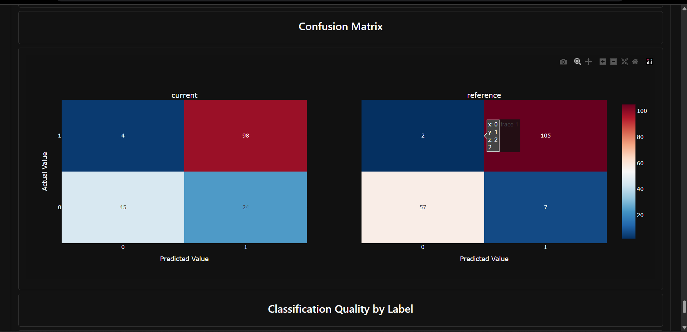
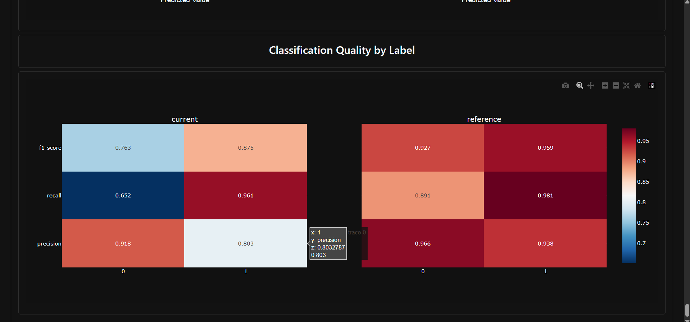

# Model Drift Detection using Evidently AI

A beginner-level MLOps project that trains a classifier, simulates real-world
production data drift, and uses **Evidently AI** to detect and visualize that
drift in an HTML report.

## Overview

Machine learning models are trained on a snapshot of data, but the real world
keeps changing. **Model drift** happens when the statistical properties of
incoming (production) data — or the relationship between features and the
target — shift away from what the model was trained on, causing performance
to silently degrade over time.

This project:

1. Trains a **Logistic Regression** model on the **Breast Cancer Wisconsin**
dataset (scikit-learn).
2. Saves a held-out **reference** dataset representing "trusted" data.
3. Simulates a **drifted production batch** (current data) using noise
injection, feature shifting, label flipping, and feature removal.
4. Uses **Evidently AI** to compare reference vs. current data and generate
a full HTML drift report.

## Project Structure

```
model-drift-evidently/
├── data/
│   ├── reference.csv          # baseline (test-split) data + predictions
│   └── current.csv            # simulated drifted production data + predictions
├── models/
│   └── model.pkl              # trained Logistic Regression model
├── reports/
│   └── model\_drift\_report.html  # Evidently drift report
├── src/
│   ├── train.py                # Task 1 \& 2: train model, save reference.csv
│   ├── simulate\_drift.py       # Task 3: simulate drift, save current.csv
│   └── drift\_report.py         # Task 4: generate Evidently report
├── requirements.txt
├── .gitignore
└── README.md
```

## Installation

```bash

git clone https://github.com/SakshiiRajputt/model-drift-evidently.gitcd model-drift-evidently
python -m venv venv
source venv/bin/activate    # on Windows: venv\\Scripts\\activate
pip install -r requirements.txt
```

## Execution

Run the three scripts in order:

```bash
python src/train.py
python src/simulate\_drift.py
python src/drift\_report.py
```

* `train.py` trains the model, prints train/test accuracy, and writes
`models/model.pkl` and `data/reference.csv`.
* `simulate\_drift.py` loads the saved model, builds a drifted production
batch, scores it, and writes `data/current.csv`.
* `drift\_report.py` compares `reference.csv` vs `current.csv` with Evidently
and writes `reports/model\_drift\_report.html`. Open this file in any
browser to view the interactive report.

## How Drift Was Simulated

`simulate\_drift.py` combines four realistic drift scenarios on a fresh,
non-overlapping slice of the dataset:

|Technique|Applied to|Simulates|
|-|-|-|
|Gaussian noise|`mean radius`, `mean texture`, `mean smoothness`, `worst concavity`|Sensor/measurement noise|
|Systematic shift (scaling)|`mean area` (×1.25), `worst perimeter` (×1.15)|Population or process change|
|Feature removal (constant fill)|`worst radius`|Upstream pipeline failure|
|Label flipping|10% of `target` values|Concept drift / labeling errors|

## Results

**Reference (test split) performance:**

|Metric|Score|
|-|-|
|Accuracy|0.947|
|Precision|0.938|
|Recall|0.981|
|F1-score|0.959|

**Current (drifted) performance:**

|Metric|Score|
|-|-|
|Accuracy|0.836|
|Precision|0.803|
|Recall|0.961|
|F1-score|0.875|

**What Evidently detected:**

* Out of 32 columns compared, **3 features showed statistically significant
drift** (Kolmogorov–Smirnov test, p < 0.05): `mean area`, `worst radius`,
and `worst perimeter` — exactly the columns that were shifted or removed
during simulation, confirming the drift detector correctly flagged the
injected changes.
* Features with only Gaussian noise added (e.g. `mean radius`,
`mean texture`) did **not** trigger drift alerts, since noise alone,
without a shift in the mean, wasn't enough to change the distribution
significantly.
* No significant drift was detected in the `target` or `prediction`
distributions overall (Z-test p > 0.05), even though 10% of labels were
flipped — with only \~171 rows, a 10% flip wasn't a large enough sample
shift to register at the dataset level, though it still measurably hurt
classification accuracy.
* Overall classification quality degraded: accuracy dropped from **94.7%**
to **83.6%**, and precision fell from **93.8%** to **80.3%**, showing that
even a small number of drifted features (3 out of 32) plus label noise can
meaningfully hurt real-world model performance.

## Screenshots





## Key Learnings

* Drift can affect individual features without affecting the entire dataset
distribution — targeted feature-level checks matter more than a single
"has the dataset drifted?" flag.
* Not all perturbations are equal: noise without a mean shift may not
register as statistical drift, while even a small systematic shift or a
removed feature is detected reliably.
* Feature drift and performance degradation don't always move in lockstep;
a model can keep "working" on the surface while quietly losing accuracy.
* Tools like Evidently AI make it practical to monitor these effects
automatically rather than discovering degraded performance after the
fact in production.

## 

